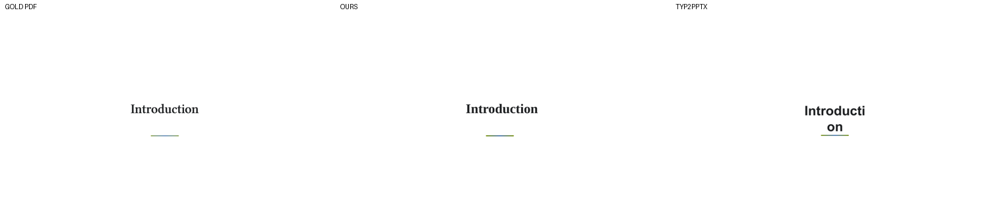

# How these exporters compare to existing Typst → Office tools

Several community tools already convert Typst to Word or PowerPoint, and "how is
this different?" is a fair first question. So before releasing, I benchmarked them
head-to-head on a shared document set with a single, tool-agnostic metric. This file
is the methodology, the numbers, and the honest conclusions — including where the
existing tools win.

**The one-paragraph answer:** existing converters work *backwards from rendered
output* — [typ2docx](https://github.com/sghng/typ2docx) reconstructs a Word file
from the compiled PDF, [typ2pptx](https://github.com/touying-typ/typ2pptx)
reconstructs slides from SVG with font/spacing heuristics, and
[touying-exporter](https://github.com/touying-typ/touying-exporter) screenshots each
slide into a picture. These exporters work *forwards from the compiler*: DOCX walks
Typst's realized element tree (real heading styles, live REF/TOC fields, native
tables, footnotes, math), and PPTX takes the laid-out page frames (exact positions,
live text, native shapes and gradients, working hyperlinks). What the other tools
must infer, the compiler simply already knows.

## Methodology

- **Document set** (`compare/SET.tsv`): 4 slide decks — calmly-touying and
  touying-aqua (Touying), basic-polylux (Polylux), diatypst — and 4 documents —
  arkheion (math-heavy paper), academi-notes-gr (report), basic-resume (CV),
  classicthesis (book). All are real published templates from the package registry.
- **Fidelity metric** (`compare/score_files.py`): render the exported .pptx/.docx to
  PDF with LibreOffice, rasterize it and the gold Typst PDF to fixed-size grayscale
  strips, score mean per-pixel agreement in [0, 1]. The same oracle used to validate
  these exporters against their full 800+-document corpus, applied identically to
  every tool's output.
- **Structure audit** (`compare/audit_structure.py`): counts of live text runs,
  heading-style references, field codes, header/footer parts, OMML math, hyperlinks,
  and images, straight from the output XML.
- **Versions**: typ2pptx 0.2.2 (PyPI), typ2docx latest release with its free
  `pdf2docx` backend (its higher-quality backends require Adobe Acrobat or Adobe
  cloud credentials, which I did not use), touying 0.14.4, pandoc 3.10, this fork at
  v0.15.0-office.1. Measured 2026-07-03 on macOS.

## PPTX: vs typ2pptx and touying-exporter

**Fidelity (agreement with the gold PDF, higher is better):**

| deck | **this exporter** | typ2pptx | touying-exporter |
|---|---|---|---|
| calmly-touying | **0.998** | 0.961 | 0.996 (raster) |
| touying-aqua | **0.994** | 0.980 | — |
| basic-polylux | **0.998** | 0.988 | — |
| diatypst | **0.998** | 0.993 | — |

This exporter wins every head-to-head — including against touying-exporter's
raster output, which is pixel-perfect by construction but has zero editable
content: its 13-slide output contains 13 `<p:pic>` images and not a single
`<a:t>` text element.

**Structure:**

| | this exporter | typ2pptx | touying-exporter |
|---|---|---|---|
| live, editable text | yes | yes | **no — images only** |
| hyperlinks (diatypst / touying-aqua) | **206 / 1** | 0 / 0 | 0 |
| native shapes, gradients, alpha | yes | yes | no |
| speaker notes | no | **yes (Touying decks)** | yes |

**What the fidelity gap looks like** (`compare/calmly-touying-slide2-3way.png`):



On the "Introduction" section divider, this exporter matches the gold PDF's serif
face and position; typ2pptx renders bold sans and wraps the word across two lines
("Introducti / on"). The XML shows why: the deck's titles are Libertinus Serif
(this exporter emits `typeface="Libertinus Serif"`), while typ2pptx emits
`typeface="Arial" b="1"` — in its source, font families are hard-coded
(`converter.py:82`: regular/bold/italic → Arial, mono → Consolas, math → Cambria
Math). It never recovers the document's actual fonts, and Arial's wider metrics
overflow the reconstructed text box.

That's one instance of the structural difference. typ2pptx parses the SVG that
typst.ts renders, then reconstructs everything with heuristics (all
file:line-verified in its source): bold/italic guessed from glyph-width ratios,
text top guessed as `baseline − 0.8 × font size`, lines grouped by a 2px baseline
tolerance, and word spaces inserted wherever a pixel gap exceeds 0.15 × the font
size. Math is never a native equation — simple formulas become Cambria Math text,
complex ones become grouped glyph-outline shapes. Several failure paths are
silent (`except Exception: pass` around notes, images, and math insertion). Its
README describes itself as "a vibe coding project… many conversion errors and edge
cases remain" — which is honest, and the point: reconstruction from rendered
output has a ceiling that reading the compiler's own layout does not.

**Where they win:** typ2pptx reconstructs Touying speaker notes (this exporter has
no speaker-notes support yet) and installs from PyPI in seconds. touying-exporter
is made by the Touying authors, and a raster deck is bulletproof if all you need
is to hit "present" in PowerPoint.

## DOCX: vs typ2docx and pandoc

**Reliability first:**

| tool | success on the 4 documents |
|---|---|
| this exporter | **4/4** |
| typ2docx (pdf2docx backend) | 3/4 — hard panic on classicthesis (`extract.rs`: "project should compile: unable to get the current date"; the same file compiles fine with plain typst) |
| pandoc | **0/4** — its Typst reader parses syntax but does not evaluate code, so every template with `#import "@preview/…"` fails immediately |

**Fidelity (pixels):**

| doc | this exporter | typ2docx |
|---|---|---|
| academi-notes-gr | 0.968 | **0.992** |
| arkheion | 0.951 | **0.970** |
| basic-resume | 0.944 | **0.964** |
| classicthesis | **0.992** | crash |

**typ2docx wins raw pixels on 3 of 4 — and that is exactly what its architecture
predicts.** It compiles the PDF, runs a PDF-to-Word engine over it, and splices
pandoc-generated OMML math in afterwards via text markers and XSLT. A page
facsimile is the easiest thing in the world to score well on a visual diff. The
question for a Word document is what you can *do* with it:

**Structure (arkheion / academi-notes-gr / basic-resume):**

| | this exporter | typ2docx |
|---|---|---|
| `Heading N` style refs (navigation pane, live TOC) | **13 / 4 / 0** | 0 / 0 / 0 |
| live fields (REF cross-refs, SEQ, TOC) | **4 / 10 / 0** | 0 / 0 / 0 |
| header/footer parts | **1 / 1 / 0** | 0 / 0 / 0 |
| styles | 35–39 curated | 164 auto-generated |
| native OMML math | 6 / 12 / 7 | 4 / 12 / 7 |
| words preserved | 579 / 105 / 429 | 588 / 110 / 430 |

Both tools preserve the text and both produce native OMML math. But typ2docx's
output is semantically flat — no heading styles, no live cross-references, and
headers/footers baked into the body — because by design only the math is spliced
in semantically; everything else is whatever the PDF-to-Word engine inferred, and
only `word/document.xml` is ever merged (headers, footers, and footnote parts are
never transformed). The marker-based math merge is also fragile: typ2docx's own
issue tracker documents unreplaced math markers producing files Word cannot open
with the free backend ([#76](https://github.com/sghng/typ2docx/issues/76)).

**Dependencies and speed:** typ2docx needs Python plus ~130 MB of packages
(pymupdf, opencv, saxonche), pandoc, and a typst binary, at 1.8–8.4 s per document
— and its best output quality requires Adobe Acrobat or Adobe cloud credentials.
This exporter is the one typst binary, 0.07–0.12 s per document, byte-reproducible
under `SOURCE_DATE_EPOCH`.

**Where they win:** with the Adobe backend (not benchmarked here), typ2docx's
visual match likely improves further — and if your only goal is "a .docx that
looks identical to the PDF" for a submission portal that will never edit it, the
facsimile approach is a perfectly rational choice. pandoc remains the right tool
for *plain* Typst markup without package imports, and converts to many more
formats than Word.

## Reproducing

```sh
# gold PDFs + this fork's outputs
typst compile --root <template-dir> <main.typ> gold/<name>.pdf
typst compile --root <template-dir> <main.typ> ours/<name>.{pptx,docx}

# score any tool's output against the gold PDFs (needs LibreOffice + poppler)
uv run compare/score_files.py <output-dir> --gold gold/

# structural audit
uv run compare/audit_structure.py <output-dir> [...]
```

The document set is listed in `compare/SET.tsv` (paths relative to a
[typst-corpus](https://github.com/typst/packages) checkout of the package
registry templates).
